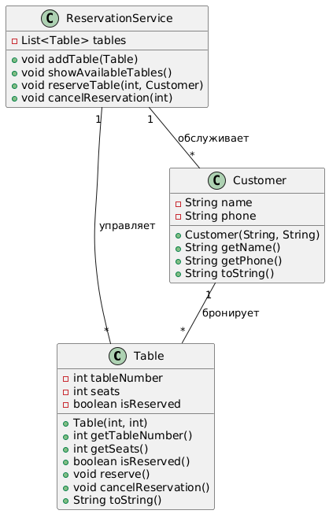

# Система бронирования столиков в ресторане

## Описание задания:
Необходимо создать систему бронирования столиков в ресторане. В системе должны быть:

* Столики (`Table`) с номером, количеством мест и статусом (свободен/забронирован).
* Клиенты (`Customer`) с именем и контактным телефоном.
* Сервис бронирования (`ReservationService`), который управляет бронированием столиков.

## Функциональность:
* Клиент может забронировать столик, если он свободен.
* Клиент может отменить бронь.
* Можно просмотреть список доступных столиков.

## Диаграмма классов 




## Описание классов, методов и полей

### Класс `Table`

#### Поля:
- `int tableNumber` – номер столика.
- `int seats` – количество мест за столиком.
- `boolean isReserved` – флаг, указывающий, забронирован ли столик.

#### Методы:
- `Table(int tableNumber, int seats)` – конструктор, принимает номер столика и количество мест.
- `int getTableNumber()` – возвращает номер столика.
- `int getSeats()` – возвращает количество мест за столиком.
- `boolean isReserved()` – возвращает статус брони (`true`, если столик забронирован, `false`, если свободен).
- `void reserve()` – устанавливает статус столика как забронированный.
- `void cancelReservation()` – отменяет бронь столика.
- `String toString()` – возвращает строковое представление столика.

---

### Класс `Customer`

#### Поля:
- `String name` – имя клиента.
- `String phone` – номер телефона клиента.

#### Методы:
- `Customer(String name, String phone)` – конструктор, принимает имя и номер телефона.
- `String getName()` – возвращает имя клиента.
- `String getPhone()` – возвращает номер телефона клиента.
- `String toString()` – возвращает строковое представление клиента.

---

### Класс `ReservationService`

#### Поля:
- `List<Table> tables` – список всех столиков в ресторане.

#### Методы:
- `void addTable(Table table)` – добавляет столик в систему бронирования.
- `void showAvailableTables()` – выводит список всех доступных столиков.
- `void reserveTable(int tableNumber, Customer customer)` – бронирует столик для указанного клиента.
- `void cancelReservation(int tableNumber)` – отменяет бронь указанного столика.


## Демонстрация работы

```java
public class RestaurantBooking {
    public static void main(String[] args) {
        // Создаем сервис бронирования
        ReservationService reservationService = new ReservationService();

        // Добавляем столики
        reservationService.addTable(new Table(1, 2));
        reservationService.addTable(new Table(2, 4));
        reservationService.addTable(new Table(3, 6));

        // Показываем доступные столики
        reservationService.showAvailableTables();

        // Создаем клиентов
        Customer customer1 = new Customer("Алексей", "123-456-789");
        Customer customer2 = new Customer("Мария", "987-654-321");

        // Клиенты бронируют столики
        reservationService.reserveTable(1, customer1);
        reservationService.reserveTable(2, customer2);

        // Показываем доступные столики после брони
        reservationService.showAvailableTables();

        // Отмена бронирования
        reservationService.cancelReservation(1);
        reservationService.showAvailableTables();
    }
}
```

## Вывод в консоли

```text
  Свободные столики:
    - Столик №1 (2 мест) - Свободен
    - Столик №2 (4 мест) - Свободен
    - Столик №3 (6 мест) - Свободен
  Столик №1 успешно забронирован.
  Клиент: Алексей (тел. 123-456-789) забронировал столик №1
  Столик №2 успешно забронирован.
  Клиент: Мария (тел. 987-654-321) забронировал столик №2
  Свободные столики:
    - Столик №3 (6 мест) - Свободен
  Бронирование столика №1 отменено.
  Свободные столики:
    - Столик №1 (2 мест) - Свободен
    - Столик №3 (6 мест) - Свободен
```