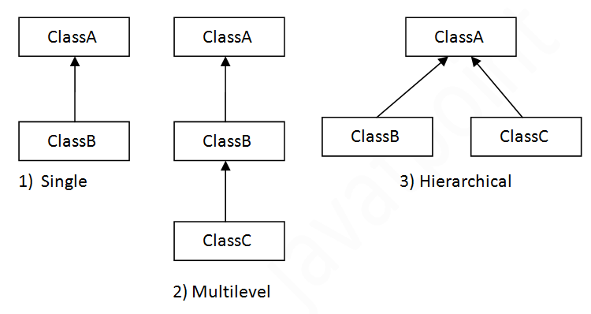
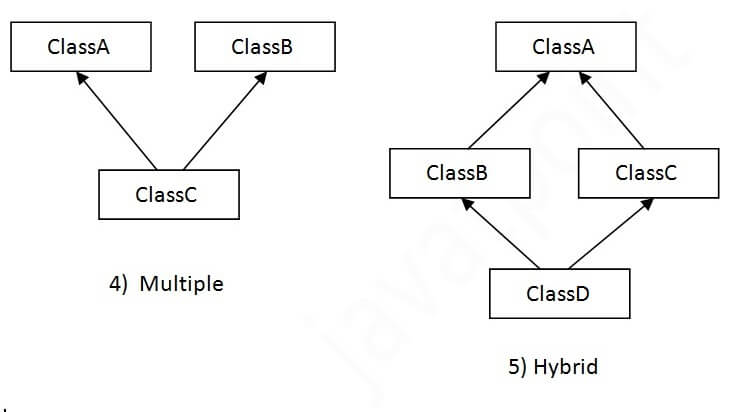
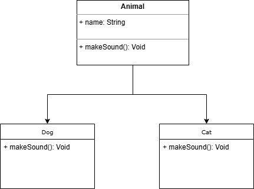

#  Наследование и полиморфизм

Цель: Освоить наследование и полиморфизм для расширения функциональности классов.

Темы: 
* Наследование, Ключевые слова extends
* ключевое слово super 

* полиморфизм в наследовании, переопределение методов
    * Аннотация `@Override` и её значение.
    * Разница между переопределением и перегрузкой методов.
    * Вызов методов базового класса через super.

* Конструкторы и наследование
  * Вызов конструктора базового класса через super().
  * Особенности порядка вызова конструкторов.

* Ключевое слово `protected`
  * Как protected помогает в наследовании.

* Введение в полиморфизм
  * Тип переменной и тип объекта.
  * Преобразование типов (upcasting, downcasting).


## Типы полиморфизма




### !!! Примечание: Множественное наследование через класс в Java не поддерживается. !!!


## Пример 
* Привмер 1: Создать базовый класс example.model.Animal с методом makeSound(), а затем два класса-наследника example.model.Dog и example.model.Cat, которые переопределяют этот метод.

)


# Практика: 

*  Создать базовый класс Vehicle с полем speed и методом move(), и два подкласса Car и Bicycle, которые изменяют поведение метода move().

*  Создать базовый класс Shape с методом для вычисления площади, и два класса-наследника Circle и Square, которые реализуют метод для своей фигуры.

---
*  Создать базовый класс `Person`, который будет представлять человека. 
    * В этом классе должны быть следующие свойства: `name` и `age`. 
    * Реализуйте конструктор, принимающий параметры `name` и `age` для инициализации этих свойств. 
    * Также создайте метод `displayInfo()`, который выводит информацию о человеке в формате: `Name: [name], Age: [age]`. 
   
* Cоздай класс-наследник `Student`, который наследует класс `Person`. В этом классе добавь новое свойство: `studentId` (идентификатор студента). 
    * Реализуйте конструктор, который принимает параметры `name`, `age` и `studentId`, и использует вызов конструктора базового класса (super) для инициализации свойств `name` и `age`. 
    * Переопредели метод `displayInfo()` в классе `Student`, чтобы он дополнительно выводил идентификатор студента в формате: `Name: [name], Age: [age], Student ID: [studentId]`.

example.Main:
```java
public class Main {
    
    public static void printInfo(Person p){
        System.out.println("--------");
        p.displayInfo();
    }
    
    public static void main(String[] args) {
        // Создание объекта базового класса
        Person person = new Person("Alice", 30);
        printInfo(person);

        // Создание объекта класса-наследника
        Student student = new Student("Bob", 20, "S12345");
        printInfo(student);
    }
}
```

Результат выполнения программы:

```text
--------
Name: Alice, Age: 30
--------
Name: Bob, Age: 20
Student ID: S12345
```