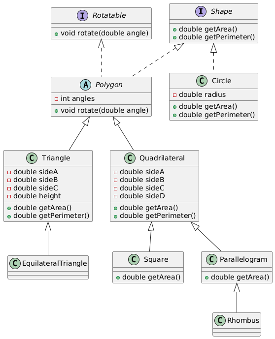

# Абстракция и Интрефейсы

* Изучить интерфейсы как инструмент для обхода ограничений одиночного наследования.

* Интерфейсы в Java, ключевое слово implements.
* Различия между интерфейсами и абстрактными классами.
* Реализация множественного наследования через интерфейсы.

# Сравнение: Обычный класс, Абстрактный класс и Интерфейс

| **Критерий**                            | **Обычный класс**                         | **Абстрактный класс**                                | **Интерфейс**                                          |
|-----------------------------------------|-------------------------------------------|------------------------------------------------------|--------------------------------------------------------|
| **Может ли быть экземпляр?**            | Да                                        | Нет (нельзя создать объект напрямую)                 | Нет (нельзя создать объект напрямую)                   |
| **Содержит реализацию методов?**        | Да                                        | Да (может содержать реализованные методы)            | Да, может содержать default и static методы            |
| **Может содержать абстрактные методы?** | Нет                                       | Да                                                   | Да                                                     |
| **Множественное наследование**          | Нет                                       | Нет (один класс-родитель)                            | Да (может реализовывать несколько интерфейсов)         |
| **Модификаторы доступа**                | Все (public, private, protected, default) | Все (public, private, protected, default)            | Только `public` для методов и полей (по умолчанию)     |
| **Предназначение**                      | Для создания объектов и реализации логики | Для создания базового поведения и общего кода        | Для определения контрактов (API)                       |
| **Полная реализация?**                  | Да                                        | Частичная                                            | Только контракт (без реализации, кроме default/static) |
| **Содержит конструкторы?**              | Да                                        | Да (но нельзя вызвать напрямую)                      | Нет                                                    |
| **Полиморфизм**                         | Поддерживается                            | Поддерживается                                       | Поддерживается                                         |
| **Свойства/поля**                       | Могут быть изменяемыми                    | Могут быть изменяемыми                               | Константы (`static final`), если не static/default     |
| **Когда использовать?**                 | Для полной реализации функциональности    | Когда нужен общий базовый функционал для наследников | Когда нужно определить контракт для классов            |


## Пример



## Практика:

## Задание 1: Абстрактный класс "Устройство"
**Описание:**
Создайте абстрактный класс `Device` с полем `name` и абстрактным методом `turnOn()`. Реализуйте два класса: `Laptop` и `Smartphone`, которые наследуют `Device`.
1. В классе `Laptop` метод `turnOn()` должен выводить:
   ```
   Laptop [имя] is booting up.
   ```
2. В классе `Smartphone` метод `turnOn()` должен выводить:
   ```
   Smartphone [имя] is turning on.
   ```

**Ожидаемый результат:**
```text
Laptop Dell is booting up.
Smartphone iPhone is turning on.
```

---

## Задание 2: Интерфейс "Оплата"
**Описание:**
Создайте интерфейс `Payable` с методом `pay(double amount)`. Реализуйте два класса: `CreditCard` и `PayPal`, которые реализуют интерфейс.
1. В `CreditCard` метод `pay()` должен выводить:
   ```
   Paid [amount] using Credit Card.
   ```
2. В `PayPal` метод `pay()` должен выводить:
   ```
   Paid [amount] using PayPal.
   ```
Напишите код, который создает массив объектов типа `Payable` и вызывает метод `pay()` для каждого объекта.

**Ожидаемый результат:**
```text
Paid 50.0 using Credit Card.
Paid 30.0 using PayPal.
```

---

## Задание 3: Множественное наследование через интерфейсы
**Описание:**
Создайте два интерфейса:
- `Movable` с методом `move()`.
- `Flyable` с методом `fly()`.

Создайте класс `Drone`, который реализует оба интерфейса.
1. Метод `move()` должен выводить:
   ```
   Drone is moving on the ground.
   ```
2. Метод `fly()` должен выводить:
   ```
   Drone is flying in the air.
   ```

**Ожидаемый результат:**
```text
Drone is moving on the ground.
Drone is flying in the air.
```

---

## Задание 4: Абстрактный класс и интерфейс в одном проекте
**Описание:**
Создайте абстрактный класс `Worker` с методами:
- `work()` (абстрактный).
- `takeBreak()` (с реализацией, которая выводит: `Worker is taking a break.`).

Создайте интерфейс `Trainable` с методом `train()`. Реализуйте два класса:
1. `Engineer`, который наследует `Worker` и реализует метод `work()`, выводя:
   ```
   Engineer is solving technical problems.
   ```
2. `Intern`, который наследует `Worker` и реализует метод `train()`, выводя:
   ```
   Intern is training.
   ```

Напишите программу, которая создает массив из объектов `Worker`, вызывает для каждого метод `work()`, а если объект реализует интерфейс `Trainable`, вызывает метод `train()`.

**Ожидаемый результат:**
```text
Engineer is solving technical problems.
Worker is taking a break.
Intern is training.
Worker is taking a break.
```

---

## Задание 5: Система транспорта
**Описание:**
Создайте абстрактный класс `Transport` с методом `move()`. Создайте интерфейс `Electric` с методом `charge()`.
1. Реализуйте класс `Car`, который наследует `Transport` и переопределяет метод `move()` так:
   ```
   Car is driving.
   ```
2. Реализуйте класс `ElectricCar`, который наследует `Car` и реализует интерфейс `Electric`.
    - Метод `charge()` должен выводить:
      ```
      ElectricCar is charging.
      ```

Напишите программу, которая создает объект `ElectricCar`, вызывает методы `move()` и `charge()`.

**Ожидаемый результат:**
```text
Car is driving.
ElectricCar is charging.
```

---

## Задание 6: Онлайн-магазин
**Описание:**
Создайте систему для онлайн-магазина.
1. Создайте абстрактный класс `Product` с полями `name` и `price`, а также методом `getDescription()` (абстрактный).
2. Реализуйте два класса:
    - `PhysicalProduct`, который выводит описание:
      ```
      Physical product: [name] costs [price].
      ```
    - `DigitalProduct`, который выводит описание:
      ```
      Digital product: [name] costs [price].
      ```
3. Создайте интерфейс `Discountable` с методом `applyDiscount(double percent)`. Реализуйте его в обоих классах.

Напишите код, который создает массив продуктов, применяет скидку и выводит описание.

**Ожидаемый результат:**
```text
Physical product: Laptop costs 900.0.
Digital product: eBook costs 18.0.
```

---

## Задание 7: Зоопарк с интерфейсами
**Описание:**
Создайте систему для зоопарка.
1. Абстрактный класс `Animal` с полем `name` и методом `makeSound()` (абстрактный).
2. Интерфейсы:
    - `Swimmable` с методом `swim()`.
    - `Flyable` с методом `fly()`.
3. Классы:
    - `Duck` (наследует `Animal` и реализует `Swimmable` и `Flyable`).
    - `Fish` (наследует `Animal` и реализует `Swimmable`).
    - `Eagle` (наследует `Animal` и реализует `Flyable`).

Напишите код, который создает список животных, вызывает методы `makeSound()`, `swim()`, и `fly()` для соответствующих животных.

**Ожидаемый результат:**
```text
Duck is quacking.
Duck is swimming.
Duck is flying.
Fish is blubbing.
Fish is swimming.
Eagle is screeching.
Eagle is flying.
